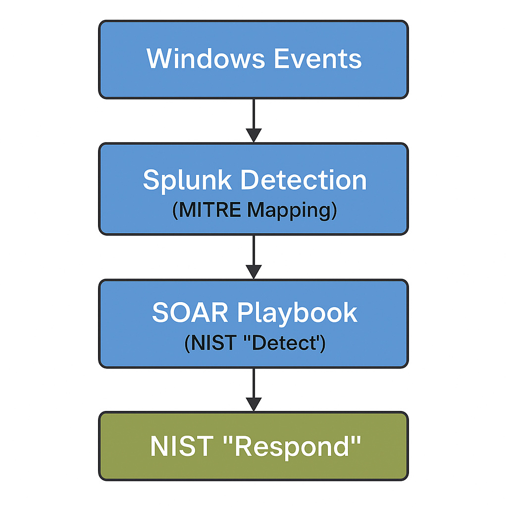

# 🔍 Splunk SIEM & SOAR Lab

This hands-on lab demonstrates how Splunk can be used as a powerful Security Information and Event Management (SIEM) and Security Orchestration, Automation, and Response (SOAR) solution. It showcases how to ingest data, create detection rules, trigger alerts, and automate incident response.

## 🛠️ Key Features

- Ingested simulated log data for testing detection capabilities
- Created correlation searches to identify suspicious activity
- Configured notable events and alerts
- Built mock playbooks for automated response using Splunk SOAR
- Integrated detection logic with real-world attack techniques

## 🎯 Tools Used

- **Splunk Cloud** (SIEM)
- **Splunk SOAR** (Automation & Response)
- Custom logs and datasets
- Framework alignment (MITRE, NIST CSF, PCI DSS)
- ### Splunk Cloud Homepage

### 🔍 Live Splunk Cloud Environment

This project is powered by Splunk Cloud (SIEM). I am actively practicing:

- Uploading and indexing log data  
- Running search queries and correlation rules  
- Visualizing results in dashboards  
- Aligning detections with the MITRE ATT&CK
- ### 📸 Splunk Cloud Log Search Example

Below is a sample search result in Splunk Cloud showing parsed mock security logs. This demonstrates successful log ingestion, event parsing, and field extraction in a simulated SOC workflow.

---

## 🔐 Security Framework Mappings

This project maps Splunk detection use cases to key cybersecurity frameworks to demonstrate real-world SOC analyst value.

- [MITRE ATT&CK Mapping](./mitre_attack.md)  
  → Correlates Splunk detections to adversarial TTPs (Tactics, Techniques, Procedures)

- [NIST Cybersecurity Framework (CSF) Alignment](./nist_csf.md)  
  → Shows how Splunk supports Detect & Respond phases

- [PCI DSS Mapping](./pci_dss.md)  
  → Highlights how Splunk helps meet compliance requirements

### 🧭 Visual Reference:

---

## 📁 Repository Structure
---

## 🚀 Future Improvements

- Add threat intelligence enrichment to detections
- Integrate additional data sources (e.g., endpoint, firewall)
- Expand playbooks for automated containment and ticketing

---

## 📫 Contact

Feel free to connect or ask questions:
[github.com/anthonycysa](https://github.com/anthonycysa)
