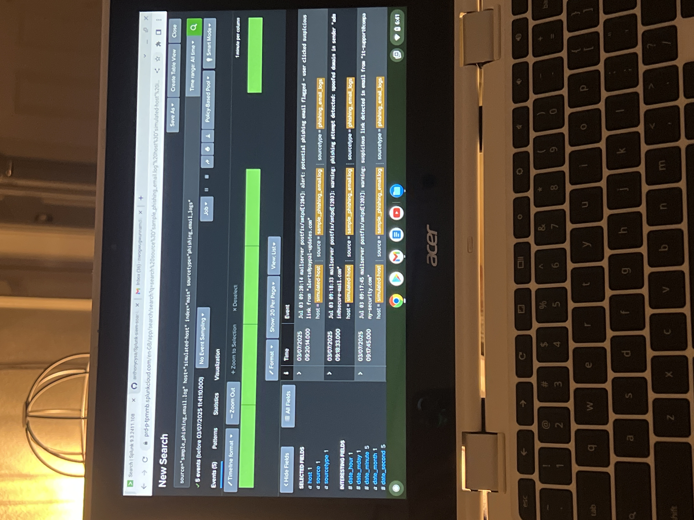

# 🛡️ Splunk SIEM + SOAR Lab

_A hands-on cybersecurity project using Splunk Cloud and SOAR playbooks to detect and respond to simulated security threats._

This lab demonstrates:
- Detection of brute force and phishing attacks
- Response automation using markdown-based SOAR playbooks
- Alignment with MITRE ATT&CK, NIST CSF, and PCI DSS
## ⚙️ Key Features

- ✅ Built using **Splunk Cloud**
- ✅ Simulated detection of brute-force and phishing attacks
- ✅ Markdown-based SOAR playbooks for response automation
- ✅ Mapped to major security frameworks:
  - MITRE ATT&CK
  - NIST Cybersecurity Framework (CSF)
  - PCI DSS v4.0
- ✅ Clear, structured GitHub layout for recruiters and SOC teams

## 🧰 Tools & Technologies

- **Splunk Cloud** – Security Information & Event Management (SIEM)
- **SOAR (Markdown-based simulation)** – Incident response automation logic
- **Nessus** – Vulnerability scanning (referenced in brute force context)
- **Wireshark** – Packet inspection for threat analysis
- **MITRE ATT&CK** – Threat behavior mapping
- **NIST CSF** – Security framework alignment
- **PCI DSS** – Compliance alignment
- **GitHub** – Project versioning and documentation
- ### Splunk Cloud Homepage

### 🔍 Live Splunk Cloud Environment

This project is powered by Splunk Cloud (SIEM). I am actively practicing:

- Uploading and indexing log data  
- Running search queries and correlation rules  
- Visualizing results in dashboards  
- Aligning detections with the MITRE ATT&CK
- ### 📸 Splunk Cloud Log Search Example

Below is a sample search result in Splunk Cloud showing parsed mock security logs. This demonstrates successful log ingestion, event parsing, and field extraction in a simulated SOC workflow.

> **📊 Splunk Dashboard Overview**  
> This dashboard summarizes mock security events, including failed/successful logins, unauthorized access attempts, and user activity logs.  
> The data is parsed from simulated log files using SPL queries and visualized to mimic real-world SOC monitoring.
> > 📁 *Note: If the image doesn't display above, you can find it directly in the repository under the filename `dashboard.jpeg`.*

---
## ⚙️ SOAR Playbooks

This project includes markdown-based SOAR playbooks that simulate automated incident response for common threats.

| Use Case | Playbook Link |
|----------|----------------|
| 🔐 Brute Force Detection & Response | [Brute Force Playbook](playbooks/brute_force_response_playbook.md) |
| 🎣 Phishing Email Response | [Phishing Playbook](playbooks/phishing_email_response_playbook.md) |
🧠 **Phishing Email Playbook Output**

Below is a screenshot showing the detection of simulated phishing email alerts in Splunk Cloud after uploading a sample log file:

### 🧠 Brute Force Playbook Output

Below is a screenshot showing the detection of multiple failed login attempts in Splunk Cloud after uploading a simulated log file:
You can find the screenshot of the detection result [here](brute_force_detection_result.jpeg.HEIC) in the repository.

## 🔐 Security Framework Mappings

This project maps Splunk detection use cases to key cybersecurity frameworks to demonstrate real-world SOC analyst value.

- [MITRE ATT&CK Mapping](./mitre_attack.md)  
  → Correlates Splunk detections to adversarial TTPs (Tactics, Techniques, Procedures)

- [NIST Cybersecurity Framework (CSF) Alignment](./nist_csf.md)  
  → Shows how Splunk supports Detect & Respond phases

- [PCI DSS Mapping](./pci_dss.md)  
  → Highlights how Splunk helps meet compliance requirements

### 🧭 Visual Reference:

---

Each playbook in this project is aligned to key security frameworks used in enterprise SOCs.

| Framework      | Mapping File |
|----------------|--------------|
| **MITRE ATT&CK** | [MITRE_ATT&CK_Mapping.md](MITRE_ATT&CK_Mapping.md) |
| **NIST CSF**     | [NIST_CSF_Mapping.md](NIST_CSF_Mapping.md)         |
| **PCI DSS v4.0** | [PCI_DSS_Mapping.md](PCI_DSS_Mapping.md)           |

## 🏁 Summary

This Splunk SIEM + SOAR lab project demonstrates:
- Realistic SOC-style detection of brute-force and phishing threats
- Automation of incident response using markdown-based SOAR playbooks
- Alignment with key frameworks: MITRE ATT&CK, NIST CSF, and PCI DSS

It serves as a practical, recruiter-ready demonstration of SOC Analyst skills using modern security tooling.

## 📫 Contact

Feel free to connect or ask questions:
[github.com/anthonycysa](https://github.com/anthonycysa)
